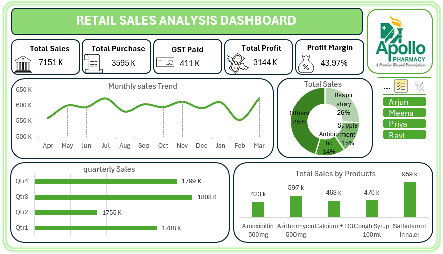

# Retail Sales Analysis Dashboard – Apollo Pharmacy

## Project Overview

This project is a Retail Sales Analysis Dashboard created using Microsoft Power BI.

The objective of this project is to analyze pharmacy retail sales, purchase performance, GST, profit, profit margin, monthly sales trends, customer-wise sales, and product performance.

The project follows an end-to-end data analysis process:

**Data Collection → Data Cleaning → Data Transformation → Data Analysis → KPI Creation → Dashboard Development → Business Insights**

---

## Dashboard Preview

---

## Key KPIs

The dashboard provides the following important business KPIs:

- **Total Sales:** 7,151 K
- **Total Purchase:** 3,595 K
- **GST Paid:** 411 K
- **Total Profit:** 3,144 K
- **Profit Margin:** 43.97%

These KPIs provide a quick overview of the overall business performance.

---

## Dashboard Analysis

### 1. Monthly Sales Trend

The monthly sales trend shows how sales performance changes throughout the year.

The dashboard helps identify:

- High-sales months
- Low-sales months
- Monthly fluctuations
- Overall sales trends

From the dashboard, **July recorded strong sales**, while **February showed a noticeable decline** before sales increased again in March.

---

### 2. Sales by Customer

The donut chart shows the contribution of customers to total sales.

The dashboard provides a customer-level view that helps identify customers contributing significantly to overall sales.

The displayed customers include:

- Arjun
- Meena
- Priya
- Ravi

---

### 3. Quarterly Sales Analysis

Quarterly sales are analyzed to compare performance across four quarters.

| Quarter | Sales |
|--------|------:|
| Q1 | 454 K |
| Q2 | 441 K |
| Q3 | 425 K |
| Q4 | 471 K |

**Q4 recorded the highest quarterly sales at 471 K**, while Q3 recorded the lowest at 425 K.

This comparison helps understand seasonal sales performance.

---

### 4. Product Sales Analysis

The product chart compares sales performance across different pharmacy products.

Products analyzed include:

- Amoxicillin 500mg
- Azithromycin 500mg
- Calcium + D3
- Cough Syrup 100ml
- Salbutamol Inhaler

Among the displayed products, **Salbutamol Inhaler recorded the highest sales at 959 K**.

This analysis helps identify high-performing products and supports better inventory and sales decisions.

---

## Data Analysis Process

### 1. Data Collection

Collected retail sales and purchase transaction data for analysis.

### 2. Data Cleaning

The data was checked and prepared for analysis by:

- Removing duplicate records
- Handling missing values
- Correcting data types
- Standardizing date fields
- Checking numerical values
- Preparing clean data for reporting

### 3. Data Transformation

The cleaned data was transformed to create meaningful fields and calculations required for analysis.

### 4. Data Analysis

Sales, purchases, GST, profit, customers, products, and monthly/quarterly performance were analyzed.

### 5. KPI Development

Important business measures were created to monitor:

- Sales
- Purchase
- GST
- Profit
- Profit Margin

### 6. Dashboard Development

An interactive Power BI dashboard was created using:

- KPI Cards
- Line Chart
- Donut Chart
- Bar Charts
- Slicers/Filters

---

## Tools & Technologies

- Microsoft Excel
- Power Query
- Power Pivot
- Microsoft Power BI
- DAX

---

## Key Business Insights

The dashboard provides the following insights:

- Overall sales reached **7.15 million**.
- Total purchase value was approximately **3.60 million**.
- Total profit was approximately **3.14 million**.
- Overall profit margin was **43.97%**.
- Q4 had the highest quarterly sales among the four quarters.
- Salbutamol Inhaler was the highest-selling product shown in the dashboard.
- Monthly sales varied throughout the year, with a noticeable decline in February.
- Customer-level analysis helps identify major contributors to sales.

---

## Skills Demonstrated

- Data Cleaning
- Data Transformation
- Data Analysis
- KPI Analysis
- Power BI Dashboard Development
- Power Query
- DAX
- Data Visualization
- Business Insight Generation
- Retail Sales Analysis

---

## Project Outcome

This project demonstrates how raw retail transaction data can be transformed into an interactive business dashboard.

The dashboard helps management quickly understand sales performance, profitability, customer contribution, product performance, and sales trends for better business decision-making.

---

## Author

**Gokulraj R**

Aspiring Data Analyst
